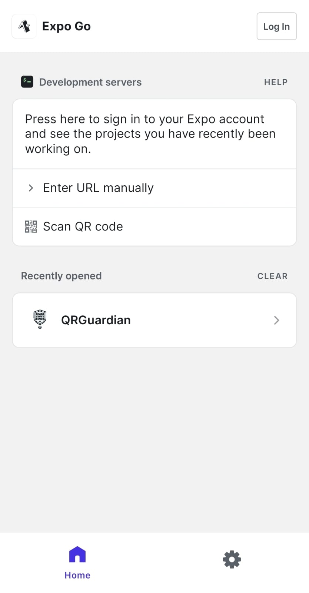

<div style="text-align: center;">
  
</div>

# Prototipo de Aplicación para Detección y Prevención de Quishing - QRGuardian


QrGuardian es un prototipo de aplicación para la detección de ataques relacionados con Quishing (un nuevo tipo de phishing usando códigos QR).

## Autor

- [@Jesus Alessandro Gutierrez Gonzales](https://github.com/JesusGuti)

## Stack de Tecnología usada
Se desarrollo el proyecto usando las siguientes tecnologias
<div style="display: flex; flex-direction:row; text-align: center; gap: 30px; justify-content: center;">
  
  
  
  
</div>

## Prerrequisitos
**NECESARIO**

- Es necesario tener instalado Node y npm configurado para poder ejecutar de forma local la aplicación.
- Se debe instalar Expo Go https://expo.dev/go, está disponible en Android e iOS.

**OPCIONAL**

- Se puede instalar Android Studio, por defecto trae un SDK actual y un dispositivo recomendado.
## APK 
Se tiene la siguiente APK 

## Ejecutar de Forma Local

1. Clonar el proyecto

```bash
  git clone https://github.com/JesusGuti/QR-Guardian.git
```

2. Ir al directorio

```bash
  cd QR-Guardian
```

3. Instalar dependencias

```bash
  npm install
```

4. Iniciar la aplicación 

```bash
  npx expo start
```

En la salida de este comando tendra la opción para abrir la aplicación en diferentes entornos:

- [Expo Go - Recomendado](https://expo.dev/go):  Dentro de la aplicación de Expo Go, se puede  escanear el código QR que se muestra en terminal . De esta forma se podrá mostrar la simulación de la aplicación usando Expo Go.


- [Emulador de Android](https://docs.expo.dev/workflow/android-studio-emulator/): Para eso será necesario instalar Android Studio, junto al SDK 35 sugerido por Expo 52.0 

- [Build de desarrollo](https://docs.expo.dev/develop/development-builds/introduction/)

